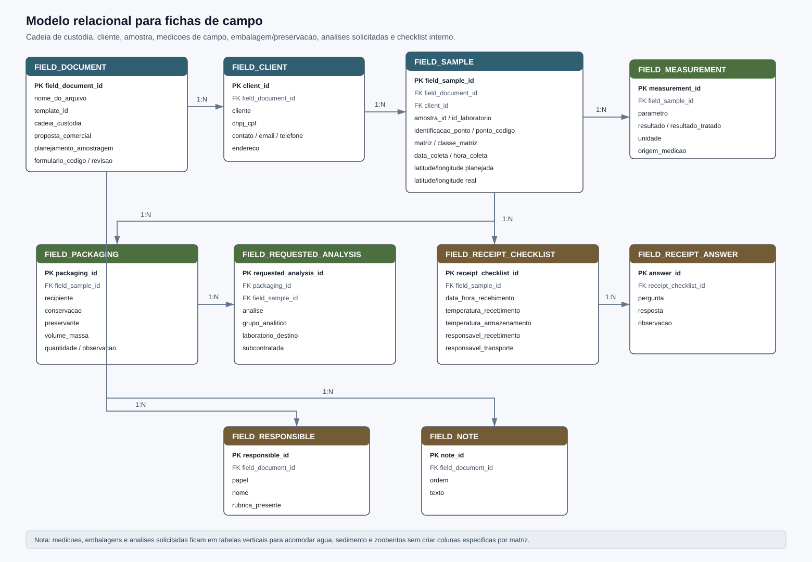
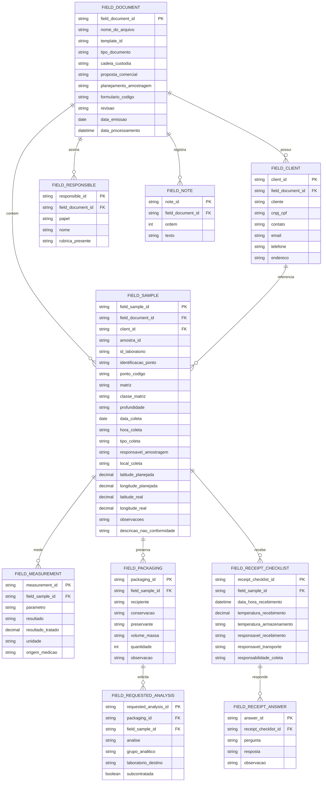

# Modelo Relacional para Fichas de Campo

Este documento descreve uma proposta de modelo relacional para armazenar os dados extraidos das fichas de campo/coleta. As fichas observadas combinam cadeia de custodia, dados do cliente, identificacao da amostra, condicoes de coleta, coordenadas, medicoes de campo, embalagem/preservacao, checklist de recebimento interno e responsaveis.

Foram observadas fichas de agua, sedimento e zoobentos. O mesmo modelo atende essas variacoes porque a matriz e a finalidade da coleta ficam em campos proprios, enquanto embalagens, preservantes, analises solicitadas e medicoes variam por linha.

## Visao Geral

## Tabelas

### `field_document`

Representa a ficha de campo/coleta processada. Deve existir uma linha por PDF.

- `field_document_id`: Identificador interno da ficha.
- `nome_do_arquivo`: Nome do PDF de origem.
- `template_id`: Template identificado pela taxonomia.
- `tipo_documento`: Tipo/familia do documento, como `ficha_coleta_tommasi`.
- `cadeia_custodia`: Codigo da cadeia de custodia, como `CA6481/2024`.
- `proposta_comercial`: Proposta comercial associada.
- `planejamento_amostragem`: Codigo do planejamento de amostragem.
- `formulario_codigo`: Codigo do formulario, como `FO-ANL-281`.
- `revisao`: Revisao do formulario.
- `data_emissao`: Data de emissao do formulario.
- `data_processamento`: Data/hora em que o arquivo foi processado.

### `field_client`

Representa os dados do cliente informados na ficha.

- `client_id`: Identificador interno do cliente.
- `field_document_id`: Ficha de origem.
- `cliente`: Nome do cliente.
- `cnpj_cpf`: Documento do cliente.
- `contato`: Pessoa de contato.
- `email`: E-mail informado.
- `telefone`: Telefone informado.
- `endereco`: Endereco informado.

### `field_sample`

Representa a amostra ou ponto de coleta descrito na ficha.

- `field_sample_id`: Identificador interno da amostra de campo.
- `field_document_id`: Ficha de origem.
- `client_id`: Cliente associado.
- `amostra_id`: Identificador textual da amostra na ficha.
- `id_laboratorio`: Identificador numerico/laboratorial quando informado junto da amostra.
- `identificacao_ponto`: Texto completo do ponto de coleta.
- `ponto_codigo`: Codigo do ponto, como `EBN 01R`.
- `matriz`: Matriz principal, como agua, sedimento ou zoobentos.
- `classe_matriz`: Classe ou descricao da matriz, como agua salobra classe 1.
- `profundidade`: Profundidade ou fracao quando aplicavel.
- `data_coleta`: Data de coleta.
- `hora_coleta`: Hora de coleta.
- `tipo_coleta`: Tipo de coleta, como simples.
- `responsavel_amostragem`: Responsavel pela amostragem.
- `local_coleta`: Local textual de coleta.
- `latitude_planejada`: Latitude informada no bloco principal.
- `longitude_planejada`: Longitude informada no bloco principal.
- `latitude_real`: Latitude real quando a ficha informa coordenada real.
- `longitude_real`: Longitude real quando a ficha informa coordenada real.
- `observacoes`: Observacoes gerais.
- `descricao_nao_conformidade`: Descricao de nao conformidade quando existir.

### `field_measurement`

Representa medicoes de campo registradas na ficha. Exemplos observados: temperatura da amostra, temperatura ambiente, pH, potencial redox e area amostral.

- `measurement_id`: Identificador da medicao.
- `field_sample_id`: Amostra associada.
- `parametro`: Nome da medicao.
- `resultado`: Valor textual preservado.
- `resultado_tratado`: Valor numerico quando aplicavel.
- `unidade`: Unidade de medida.
- `origem_medicao`: Origem ou contexto, como campo, amostra ou ambiente.

### `field_packaging`

Representa recipientes, conservacao, preservantes e volumes/massas associados a amostra.

- `packaging_id`: Identificador da embalagem.
- `field_sample_id`: Amostra associada.
- `recipiente`: Tipo de recipiente, como polietileno, vidro ambar ou pote plastico.
- `conservacao`: Condicao de conservacao, como `0 a 6 C`.
- `preservante`: Preservante, como `HNO3`, `H2SO4`, formol ou alcool.
- `volume_massa`: Volume ou massa declarada, como `300 mL`, `500 g`.
- `quantidade`: Quantidade de frascos quando informada.
- `observacao`: Observacao adicional.

### `field_requested_analysis`

Representa as analises solicitadas para cada embalagem/preservacao.

- `requested_analysis_id`: Identificador da analise solicitada.
- `packaging_id`: Embalagem associada.
- `field_sample_id`: Amostra associada.
- `analise`: Nome da analise solicitada.
- `grupo_analitico`: Grupo derivado, como metais, microbiologicos, nutrientes ou clorofila.
- `laboratorio_destino`: Laboratorio de destino quando indicado por marcador, como `E*`, `B*`, `LM*` ou `ALS*`.
- `subcontratada`: Indica se a analise foi enviada a laboratorio externo.

### `field_receipt_checklist`

Representa o checklist de recebimento interno que aparece dentro da ficha de campo.

- `receipt_checklist_id`: Identificador do checklist.
- `field_sample_id`: Amostra associada.
- `data_hora_recebimento`: Data/hora de recebimento.
- `temperatura_recebimento`: Temperatura medida no recebimento.
- `temperatura_armazenamento`: Faixa de armazenamento prevista.
- `responsavel_recebimento`: Responsavel pelo recebimento.
- `responsavel_transporte`: Responsavel pelo transporte.
- `responsabilidade_coleta`: Responsabilidade declarada pela coleta.

### `field_receipt_answer`

Representa as respostas do checklist de recebimento interno.

- `answer_id`: Identificador da resposta.
- `receipt_checklist_id`: Checklist associado.
- `pergunta`: Pergunta do checklist.
- `resposta`: Resposta marcada, como sim, nao ou nao aplicavel.
- `observacao`: Observacao complementar.

### `field_responsible`

Representa pessoas e papeis de responsabilidade/assinatura.

- `responsible_id`: Identificador do responsavel.
- `field_document_id`: Ficha de origem.
- `papel`: Papel na ficha, como coletor, acompanhante, responsavel tecnico, transporte ou recebimento.
- `nome`: Nome informado.
- `rubrica_presente`: Indicacao textual/booleana de rubrica quando detectavel.

### `field_note`

Representa notas e textos explicativos da ficha.

- `note_id`: Identificador da nota.
- `field_document_id`: Ficha de origem.
- `ordem`: Ordem da nota.
- `texto`: Texto da nota.

## Observacoes de Modelagem

- A ficha de campo mistura coleta e recebimento interno. Por isso o checklist interno fica ligado a `field_sample`, enquanto fichas de recebimento de laboratorios externos devem ficar em modelo proprio.
- Embalagem/preservacao e analises solicitadas devem ser normalizadas em tabelas separadas. Uma embalagem pode listar varias analises, e a mesma amostra pode ter muitas embalagens.
- Medicoes de campo devem ser verticais em `field_measurement`, pois agua, sedimento e zoobentos possuem conjuntos diferentes de parametros.
- O campo `nome_do_arquivo` deve ser mantido em `field_document` e propagado para saidas auditaveis quando necessario.
- Marcadores como `E*`, `B*`, `LM*` e `ALS*` devem ser preservados, pois indicam provavel envio a provedor externo.
