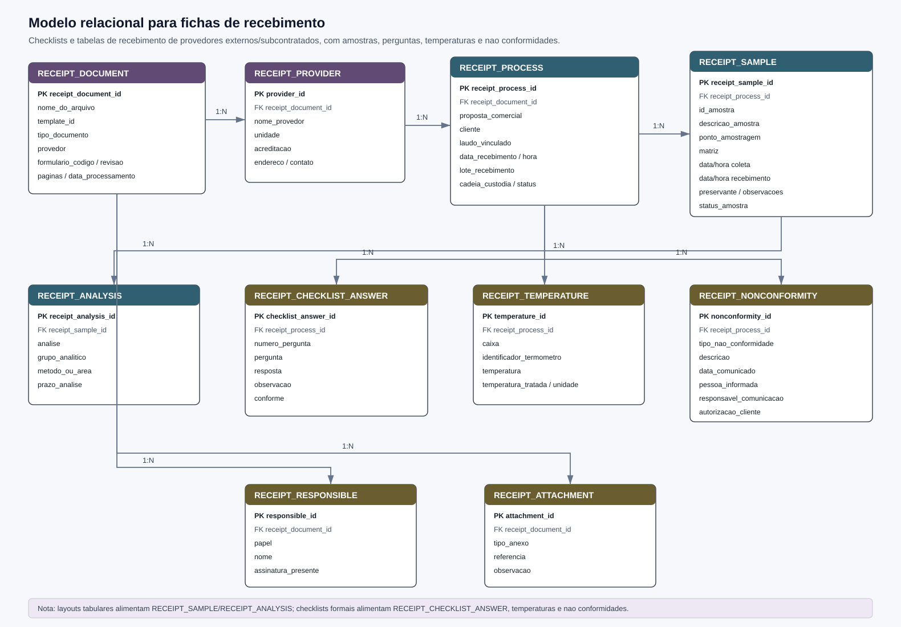
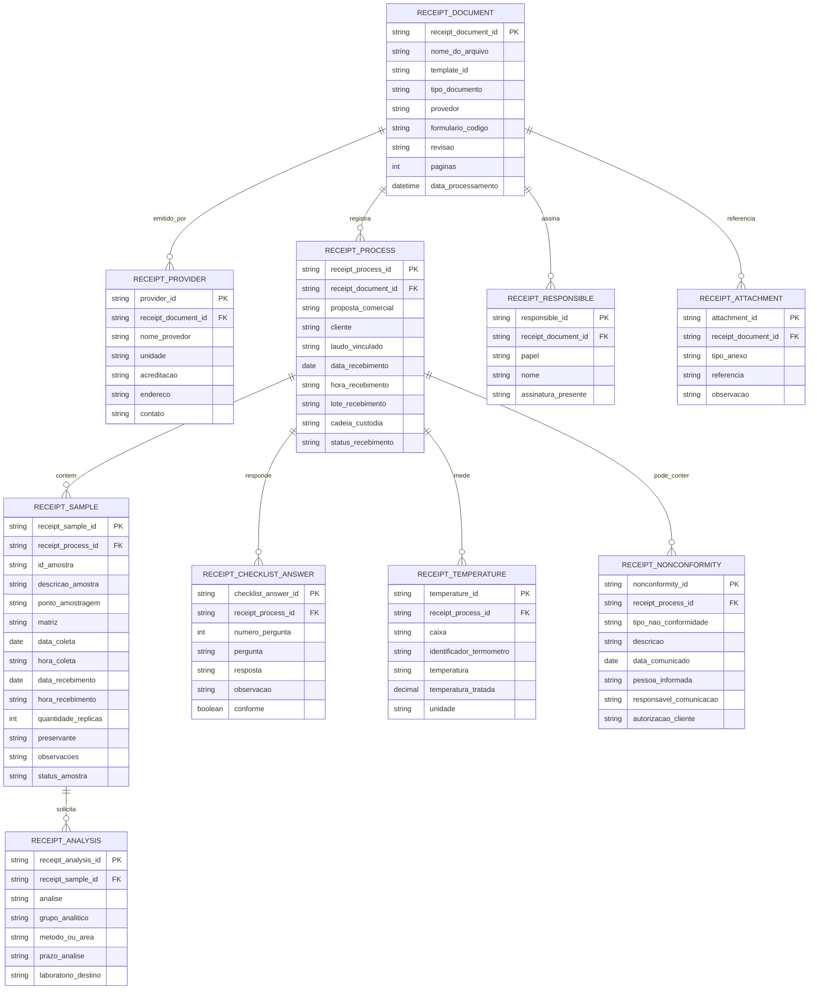

# Modelo Relacional para Fichas de Recebimento

Este documento descreve uma proposta de modelo relacional para armazenar os dados extraidos das fichas/checklists de recebimento de laboratorios externos e subcontratados. Foram observados documentos em `COC_subcontratadas` com layouts diferentes entre provedores, como Ethica, Labmar, Aplysia, Bioagri e ALS.

Alguns documentos sao tabelas de recebimento por amostra, com responsavel pela entrega, responsavel pelo recebimento, data/hora de coleta, data/hora de recebimento, matriz, analise, preservante e observacoes. Outros sao checklists formais de recebimento, com perguntas, respostas, temperaturas, comunicacao de nao conformidade e relacao de amostras.

## Visao Geral

## Tabelas

### `receipt_document`

Representa o PDF de recebimento processado. Deve existir uma linha por arquivo.

- `receipt_document_id`: Identificador interno do documento.
- `nome_do_arquivo`: Nome do PDF de origem.
- `template_id`: Template identificado pela taxonomia.
- `tipo_documento`: Tipo/familia do documento, como `ficha_recebimento_ethica`, `ficha_recebimento_labmar`, `ficha_recebimento_aplysia`, `ficha_recebimento_bioagri` ou `ficha_subcontratacao_als`.
- `provedor`: Provedor/laboratorio associado.
- `formulario_codigo`: Codigo do formulario, quando existir.
- `revisao`: Revisao do formulario.
- `paginas`: Numero de paginas do PDF.
- `data_processamento`: Data/hora em que o arquivo foi processado.

### `receipt_provider`

Representa o laboratorio/provedor externo.

- `provider_id`: Identificador do provedor.
- `receipt_document_id`: Documento de origem.
- `nome_provedor`: Nome do provedor.
- `unidade`: Unidade ou filial quando informada.
- `acreditacao`: Acreditacao ou codigo de laboratorio quando informado.
- `endereco`: Endereco do provedor.
- `contato`: Contato informado.

### `receipt_process`

Representa o evento/processo de recebimento.

- `receipt_process_id`: Identificador do processo de recebimento.
- `receipt_document_id`: Documento de origem.
- `proposta_comercial`: Proposta comercial associada.
- `cliente`: Cliente ou remetente informado.
- `laudo_vinculado`: Laudo/processo vinculado, quando informado.
- `data_recebimento`: Data de recebimento.
- `hora_recebimento`: Hora de recebimento.
- `lote_recebimento`: Identificador de lote ou remessa quando existir.
- `cadeia_custodia`: Cadeia de custodia associada.
- `status_recebimento`: Situacao geral do recebimento.

### `receipt_sample`

Representa cada amostra recebida. Em layouts tabulares, cada linha da tabela vira uma linha nesta entidade.

- `receipt_sample_id`: Identificador interno da amostra recebida.
- `receipt_process_id`: Processo de recebimento associado.
- `id_amostra`: Identificador da amostra.
- `descricao_amostra`: Descricao textual do ponto/amostra.
- `ponto_amostragem`: Codigo ou nome do ponto de amostragem.
- `matriz`: Matriz informada, como agua, sedimento, clorofila, fito ou outra.
- `data_coleta`: Data de coleta.
- `hora_coleta`: Hora de coleta.
- `data_recebimento`: Data de recebimento da amostra, quando a tabela informa por linha.
- `hora_recebimento`: Hora de recebimento da amostra.
- `quantidade_replicas`: Quantidade de replicas/frascos quando informada.
- `preservante`: Preservante ou condicao de preservacao.
- `observacoes`: Observacoes da linha.
- `status_amostra`: Status como `OK`, pendente, nao conforme ou outro valor textual.

### `receipt_analysis`

Representa analises solicitadas ou area/metodo associado a amostra recebida.

- `receipt_analysis_id`: Identificador da analise.
- `receipt_sample_id`: Amostra recebida associada.
- `analise`: Analise solicitada.
- `grupo_analitico`: Grupo derivado, como clorofila, metais, mercurio, granulometria ou microbiologia.
- `metodo_ou_area`: Metodo, area ou setor quando informado.
- `prazo_analise`: Prazo de analise quando informado no checklist.
- `laboratorio_destino`: Laboratorio responsavel pela execucao.

### `receipt_checklist_answer`

Representa perguntas e respostas do checklist de recebimento.

- `checklist_answer_id`: Identificador da resposta.
- `receipt_process_id`: Processo de recebimento associado.
- `numero_pergunta`: Numero da pergunta quando existir.
- `pergunta`: Texto da pergunta.
- `resposta`: Resposta marcada, como sim, nao, x ou texto livre.
- `observacao`: Observacao complementar.
- `conforme`: Resultado booleano derivado quando possivel.

### `receipt_temperature`

Representa temperaturas registradas no recebimento.

- `temperature_id`: Identificador do registro.
- `receipt_process_id`: Processo de recebimento associado.
- `caixa`: Caixa ou recipiente associado.
- `identificador_termometro`: Termometro ou equipamento usado.
- `temperatura`: Valor textual preservado.
- `temperatura_tratada`: Valor numerico quando aplicavel.
- `unidade`: Unidade, normalmente graus Celsius.

### `receipt_nonconformity`

Representa nao conformidades e comunicacoes ao cliente.

- `nonconformity_id`: Identificador da nao conformidade.
- `receipt_process_id`: Processo de recebimento associado.
- `tipo_nao_conformidade`: Tipo ou classe da nao conformidade.
- `descricao`: Descricao textual.
- `data_comunicado`: Data de comunicacao ao cliente.
- `pessoa_informada`: Pessoa informada.
- `responsavel_comunicacao`: Responsavel pela comunicacao.
- `autorizacao_cliente`: Autorizacao ou decisao do cliente.

### `receipt_responsible`

Representa responsaveis por entrega, recebimento, comunicacao e assinatura.

- `responsible_id`: Identificador do responsavel.
- `receipt_document_id`: Documento de origem.
- `papel`: Papel no documento, como entrega, recebimento, comunicacao ou tecnico.
- `nome`: Nome informado.
- `assinatura_presente`: Indicacao textual/booleana de assinatura quando detectavel.

### `receipt_attachment`

Representa anexos, referencias e documentos vinculados.

- `attachment_id`: Identificador do anexo/referencia.
- `receipt_document_id`: Documento de origem.
- `tipo_anexo`: Tipo de anexo, como cadeia de custodia, e-mail de nao conformidade, laudo vinculado ou imagem.
- `referencia`: Codigo/referencia do anexo.
- `observacao`: Observacao complementar.

## Observacoes de Modelagem

- As fichas de recebimento nao devem compartilhar a mesma tabela de amostras das fichas de campo sem uma chave de conciliacao. O vinculo entre coleta, recebimento e laudo deve ser feito por `id_amostra`, `cadeia_custodia`, `proposta_comercial`, data/hora e nome do arquivo.
- Layouts de recebimento por tabela e checklists por pergunta cabem no mesmo modelo: a tabela alimenta `receipt_sample` e `receipt_analysis`; o checklist alimenta `receipt_checklist_answer`.
- Alguns PDFs podem ser digitalizados e sem texto extraivel. Para esses casos, o modelo continua valido, mas a extracao depende de OCR antes do parser tabular.
- O campo `nome_do_arquivo` deve ser mantido no nivel do documento para rastreabilidade.
- Provedores diferentes podem ter campos especificos; campos incomuns devem entrar primeiro em `receipt_attachment`, `receipt_checklist_answer` ou `observacao` antes de virar coluna estrutural nova.
