# Modelo Relacional para Laudos de Agua

Este documento descreve uma proposta de modelo relacional para armazenar os dados extraidos dos laudos de agua. A ideia e separar as entidades reais do PDF em tabelas proprias, mantendo rastreabilidade entre documento, amostra, cliente, secoes/tabelas e resultados.

O Excel `results_extract` continua sendo uma boa saida auditavel, mas em banco de dados o ideal e evitar uma tabela unica muito larga. O modelo abaixo organiza o laudo como um conjunto de entidades relacionadas.

## Visao Geral

```mermaid
erDiagram
    DOCUMENT ||--o{ CLIENT : possui
    DOCUMENT ||--o{ SAMPLE : contem
    CLIENT ||--o{ SAMPLE : referencia
    SAMPLE ||--o{ RESULT_SECTION : organiza
    RESULT_SECTION ||--o{ ANALYTICAL_RESULT : contem
    RESULT_SECTION ||--o{ QUALITY_CONTROL_RESULT : contem

    DOCUMENT {
        string document_id PK
        string nome_do_arquivo
        string template_id
        string tipo_laudo
        string numero_relatorio
        date data_publicacao
        datetime data_processamento
    }

    CLIENT {
        string client_id PK
        string document_id FK
        string proposta_comercial
        string cliente
        string cnpj_cpf
        string contato
        string telefone
        string endereco
    }

    SAMPLE {
        string sample_id PK
        string document_id FK
        string client_id FK
        string id_amostra
        string tipo_amostra
        string criterio_conformidade
        date data_coleta
        string dh_coleta
        date data_recebimento
        string dh_recebimento
        string localizacao
        decimal latitude
        decimal longitude
        string coordenadas
        string tipo_coleta
        string responsavel_amostra
    }

    RESULT_SECTION {
        string section_id PK
        string document_id FK
        string sample_id FK
        string categoria
        string subcategoria
        string tipo_registro
        string local
        int pagina_inicio
        int ordem_no_documento
    }

    ANALYTICAL_RESULT {
        string result_id PK
        string section_id FK
        string sample_id FK
        string parameter
        string resultado
        decimal resultado_tratado
        string qualificador
        string unidade
        date data_inicio
        string criterio_conformidade
        string lq_original
        decimal lq_minimo
        decimal lq_maximo
        string lq_unidade
        string referencia
        string incerteza_original
        decimal incerteza_valor
        string incerteza_unidade
    }

    QUALITY_CONTROL_RESULT {
        string qc_result_id PK
        string section_id FK
        string sample_id FK
        string tipo_registro
        string parameter
        string numero_cq
        string resultado
        decimal resultado_tratado
        string unidade
        string duplicata
        string faixa_aceitacao_original
        string faixa_aceitacao_operador
        decimal faixa_aceitacao_minimo
        decimal faixa_aceitacao_maximo
        string faixa_aceitacao_unidade
        string variacao_percentual
        string quantidade_adicionada
        string recuperacao_percentual
    }
```

## Tabelas

### `document`

Representa o PDF/laudo processado. Deve existir uma linha por arquivo de origem.

- `document_id`: Identificador interno do documento.
- `nome_do_arquivo`: Nome do PDF de origem.
- `template_id`: Template identificado pela taxonomia.
- `tipo_laudo`: Tema/familia do laudo, como `laudo_agua`.
- `numero_relatorio`: Numero do relatorio, quando identificado.
- `data_publicacao`: Data de publicacao do laudo.
- `data_processamento`: Data/hora em que o arquivo foi processado.

### `client`

Representa os dados de identificacao do cliente informados no documento.

- `client_id`: Identificador interno do cliente no contexto da extracao.
- `document_id`: Documento de origem.
- `proposta_comercial`: Codigo da proposta comercial.
- `cliente`: Nome do cliente.
- `cnpj_cpf`: Documento do cliente.
- `contato`: Pessoa de contato.
- `telefone`: Telefone informado.
- `endereco`: Endereco informado.

### `sample`

Representa a amostra descrita no laudo.

- `sample_id`: Identificador interno da amostra.
- `document_id`: Documento de origem.
- `client_id`: Cliente associado.
- `id_amostra`: Identificador da amostra no laudo.
- `tipo_amostra`: Tipo de amostra, como agua doce, agua salobra ou sedimento.
- `criterio_conformidade`: Criterio de conformidade do cabecalho.
- `data_coleta`: Data de coleta.
- `dh_coleta`: Horario de coleta.
- `data_recebimento`: Data de recebimento.
- `dh_recebimento`: Horario de recebimento.
- `localizacao`: Local de coleta.
- `latitude`: Latitude numerica.
- `longitude`: Longitude numerica.
- `coordenadas`: Coordenadas no formato textual consolidado.
- `tipo_coleta`: Tipo de coleta.
- `responsavel_amostra`: Responsavel pela amostragem.

### `result_section`

Representa uma secao ou tabela reconhecida no PDF, como constituintes inorganicos, microbiologicos, branco, duplicata ou recuperacao.

- `section_id`: Identificador interno da secao.
- `document_id`: Documento de origem.
- `sample_id`: Amostra associada.
- `categoria`: Categoria da secao.
- `subcategoria`: Subcategoria, quando existir.
- `tipo_registro`: Tipo de registro, como `AMOSTRA`, `BRANCO`, `DUPLICATA` ou `RECUPERACAO`.
- `local`: Local associado a secao, como campo ou laboratorio.
- `pagina_inicio`: Pagina onde a secao foi encontrada.
- `ordem_no_documento`: Ordem da secao dentro do PDF.

### `analytical_result`

Representa os resultados analiticos principais da amostra.

- `result_id`: Identificador interno do resultado.
- `section_id`: Secao de origem.
- `sample_id`: Amostra associada.
- `parameter`: Parametro analisado.
- `resultado`: Resultado textual preservado como aparece no PDF.
- `resultado_tratado`: Resultado numerico tratado, quando aplicavel.
- `qualificador`: Qualificador, como `<` ou `>`.
- `unidade`: Unidade do resultado.
- `data_inicio`: Data de inicio da analise.
- `criterio_conformidade`: Criterio de conformidade da linha.
- `lq_original`: LQ textual original.
- `lq_minimo`: Valor minimo do LQ.
- `lq_maximo`: Valor maximo do LQ.
- `lq_unidade`: Unidade do LQ.
- `referencia`: Metodo/referencia.
- `incerteza_original`: Incerteza textual original.
- `incerteza_valor`: Valor numerico da incerteza.
- `incerteza_unidade`: Unidade da incerteza.

### `quality_control_result`

Representa resultados de controle de qualidade, como branco, duplicata e recuperacao.

- `qc_result_id`: Identificador interno do resultado de QA/QC.
- `section_id`: Secao de origem.
- `sample_id`: Amostra associada.
- `tipo_registro`: Tipo de QA/QC, como `BRANCO`, `DUPLICATA` ou `RECUPERACAO`.
- `parameter`: Parametro analisado.
- `numero_cq`: Numero do controle de qualidade.
- `resultado`: Resultado textual preservado.
- `resultado_tratado`: Resultado numerico tratado, quando aplicavel.
- `unidade`: Unidade do resultado.
- `duplicata`: Valor de duplicata.
- `faixa_aceitacao_original`: Faixa de aceitacao textual original.
- `faixa_aceitacao_operador`: Operador da faixa, como `<`, `>` ou `=`.
- `faixa_aceitacao_minimo`: Valor minimo da faixa.
- `faixa_aceitacao_maximo`: Valor maximo da faixa.
- `faixa_aceitacao_unidade`: Unidade da faixa.
- `variacao_percentual`: Variacao percentual.
- `quantidade_adicionada`: Quantidade adicionada.
- `recuperacao_percentual`: Recuperacao percentual.

## Observacoes de Implementacao

- A saida Excel atual pode continuar existindo como camada auditavel.
- A transformacao para o modelo relacional pode ser uma etapa posterior ao parser.
- O `document_id`, `client_id`, `sample_id`, `section_id`, `result_id` e `qc_result_id` podem ser gerados por hash deterministico, evitando ids aleatorios.
- `analytical_result` deve receber apenas registros `AMOSTRA`.
- `quality_control_result` deve receber registros de QA/QC, como `BRANCO`, `DUPLICATA` e `RECUPERACAO`.
- Se futuramente outros temas tiverem abas adicionais, o modelo pode ganhar tabelas especializadas por tema sem alterar as entidades comuns.
