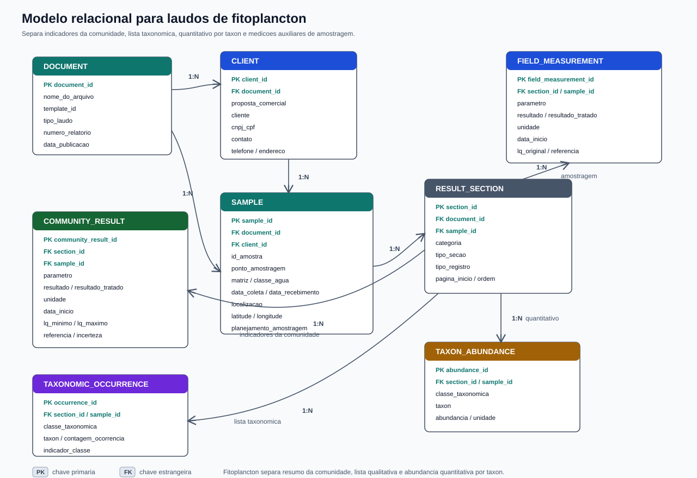
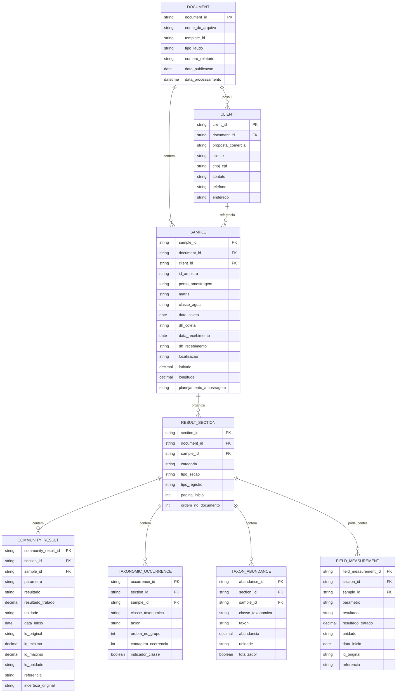

# Modelo Relacional para Laudos de Fitoplancton

Este documento descreve uma proposta de modelo relacional para armazenar os dados extraidos dos laudos de fitoplancton. A estrutura difere dos laudos fisico-quimicos porque o documento combina resultados resumidos da comunidade, anexos taxonomicos qualitativos e, em alguns casos, resultados quantitativos por taxon.

O Excel `results_extract` continua sendo uma boa saida auditavel. Para banco de dados, o ideal e separar os resultados de comunidade, a lista taxonomica, os quantitativos por organismo e os resultados auxiliares de amostragem.

## Visao Geral

## Tabelas

### `document`

Representa o PDF/laudo processado. Deve existir uma linha por arquivo de origem.

- `document_id`: Identificador interno do documento.
- `nome_do_arquivo`: Nome do PDF de origem.
- `template_id`: Template identificado pela taxonomia.
- `tipo_laudo`: Tema/familia do laudo, como `laudo_fito`.
- `numero_relatorio`: Numero do relatorio, quando identificado.
- `data_publicacao`: Data de publicacao do laudo.
- `data_processamento`: Data/hora em que o arquivo foi processado.

### `client`

Representa os dados de identificacao do cliente informados no documento.

- `client_id`: Identificador interno do cliente no contexto da extracao.
- `document_id`: Documento de origem.
- `proposta_comercial`: Codigo da proposta comercial.
- `cliente`: Nome do cliente.
- `cnpj_cpf`: Documento do cliente.
- `contato`: Pessoa de contato.
- `telefone`: Telefone informado.
- `endereco`: Endereco informado.

### `sample`

Representa a amostra associada ao laudo de fitoplancton.

- `sample_id`: Identificador interno da amostra.
- `document_id`: Documento de origem.
- `client_id`: Cliente associado.
- `id_amostra`: Identificador da amostra no laudo.
- `ponto_amostragem`: Ponto/estacao da amostra, quando derivado do cabecalho.
- `matriz`: Matriz principal, normalmente agua.
- `classe_agua`: Classe da agua, como agua doce classe 2.
- `data_coleta`: Data de coleta.
- `dh_coleta`: Horario de coleta.
- `data_recebimento`: Data de recebimento.
- `dh_recebimento`: Horario de recebimento.
- `localizacao`: Local de coleta.
- `latitude`: Latitude numerica.
- `longitude`: Longitude numerica.
- `planejamento_amostragem`: Codigo do planejamento de amostragem.

### `result_section`

Representa uma secao/tabela reconhecida no PDF.

Exemplos observados:

- `Comunidade Fitoplanctonica`
- `Anexo - LISTA TAXONOMICA`
- `QUANTITATIVO (Org./mL)`
- `Amostragem`

Campos:

- `section_id`: Identificador interno da secao.
- `document_id`: Documento de origem.
- `sample_id`: Amostra associada.
- `categoria`: Categoria da secao.
- `tipo_secao`: Tipo funcional, como `comunidade`, `lista_taxonomica`, `quantitativo` ou `amostragem`.
- `tipo_registro`: Tipo de registro no parser, quando aplicavel.
- `pagina_inicio`: Pagina onde a secao foi encontrada.
- `ordem_no_documento`: Ordem da secao dentro do PDF.

### `community_result`

Representa os resultados resumidos da comunidade fitoplanctonica.

Exemplos:

- `Quantificacao de Cianobacterias`
- `Densidade numerica`
- `Numero de Taxons`
- `Fitoplancton - Qualitativo`

Campos:

- `community_result_id`: Identificador interno do resultado.
- `section_id`: Secao de origem.
- `sample_id`: Amostra associada.
- `parametro`: Nome do indicador.
- `resultado`: Resultado textual preservado como aparece no PDF.
- `resultado_tratado`: Resultado numerico tratado, quando aplicavel.
- `unidade`: Unidade, como `cel/mL` ou `org/mL`.
- `data_inicio`: Data de inicio da analise.
- `lq_original`: LQ textual original.
- `lq_minimo`: Valor minimo do LQ.
- `lq_maximo`: Valor maximo do LQ.
- `lq_unidade`: Unidade do LQ.
- `referencia`: Metodo/referencia, como CETESB L5.303.
- `incerteza_original`: Incerteza textual original.

### `taxonomic_occurrence`

Representa a lista taxonomica qualitativa do anexo. Essa tabela preserva tanto os grupos taxonomicos quanto os taxons listados.

- `occurrence_id`: Identificador interno da ocorrencia.
- `section_id`: Secao de origem.
- `sample_id`: Amostra associada.
- `classe_taxonomica`: Classe/grupo, como `BACILLARIOPHYCEAE` ou `CYANOPHYCEAE`.
- `taxon`: Nome do taxon.
- `ordem_no_grupo`: Ordem em que o taxon aparece dentro do grupo.
- `contagem_ocorrencia`: Valor apresentado ao lado do taxon, quando existir.
- `indicador_classe`: Indica se a linha representa um grupo/classe e nao um taxon individual.

### `taxon_abundance`

Representa o quantitativo por taxon, normalmente apresentado em `QUANTITATIVO (Org./mL)`.

- `abundance_id`: Identificador interno da abundancia.
- `section_id`: Secao de origem.
- `sample_id`: Amostra associada.
- `classe_taxonomica`: Classe/grupo taxonomico.
- `taxon`: Nome do taxon.
- `abundancia`: Valor numerico da abundancia.
- `unidade`: Unidade, normalmente `org/mL`.
- `totalizador`: Indica se a linha e um total do grupo ou total geral.

### `field_measurement`

Representa resultados auxiliares de amostragem que podem aparecer em paginas complementares do laudo, como profundidade de coleta e profundidade total.

- `field_measurement_id`: Identificador interno da medicao.
- `section_id`: Secao de origem.
- `sample_id`: Amostra associada.
- `parametro`: Nome do parametro de campo.
- `resultado`: Resultado textual preservado.
- `resultado_tratado`: Resultado numerico tratado.
- `unidade`: Unidade do resultado, como `m`.
- `data_inicio`: Data da medicao/analise.
- `lq_original`: LQ textual original.
- `referencia`: Metodo/referencia.

## Observacoes de Implementacao

- O laudo de fitoplancton pode ter uma parte analitica principal e uma parte complementar `.NA` com resultados de amostragem.
- Alguns laudos trazem apenas `Quantificacao de Cianobacterias`, sem lista taxonomica completa.
- A lista taxonomica mistura linhas de classe/grupo e linhas de taxon; por isso `taxonomic_occurrence` possui `indicador_classe`.
- O quantitativo por taxon deve ficar separado da lista qualitativa, pois possui unidade e medida numerica propria.
- `community_result` cobre os indicadores resumidos do laudo e nao deve ser confundida com cada taxon individual.
- Hoje a taxonomia de fito identifica o template e reaproveita schemas de cabecalho; as regras completas de `section_config`, `section_aliases` e `result_layouts` ainda precisam ser cadastradas para extrair os resultados de fito.
