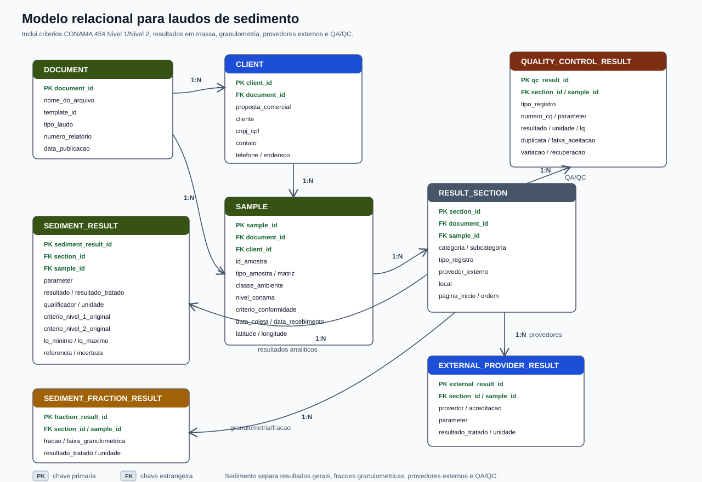
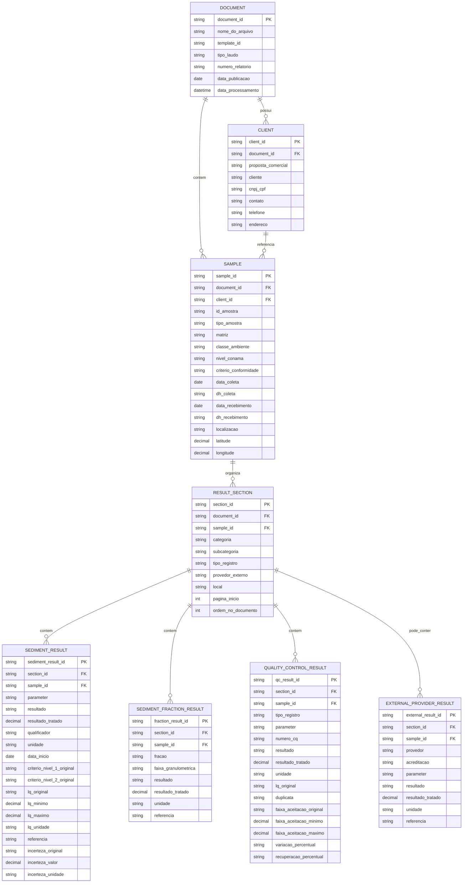

# Modelo Relacional para Laudos de Sedimento

Este documento descreve uma proposta de modelo relacional para armazenar os dados extraidos dos laudos de sedimento. A estrutura e parecida com a dos laudos de agua, mas os laudos de sedimento possuem caracteristicas proprias: criterio CONAMA 454, comparacao por nivel, resultados em `mg/kg`, `ug/kg` e `%`, secoes de granulometria e dados gerados por provedores externos.

O Excel `results_extract` continua sendo uma boa saida auditavel. Para banco de dados, o modelo abaixo separa as entidades do documento em tabelas relacionais, preservando a rastreabilidade entre o PDF, a amostra, as secoes e os resultados.

## Visao Geral

## Tabelas

### `document`

Representa o PDF/laudo processado. Deve existir uma linha por arquivo de origem.

- `document_id`: Identificador interno do documento.
- `nome_do_arquivo`: Nome do PDF de origem.
- `template_id`: Template identificado pela taxonomia.
- `tipo_laudo`: Tema/familia do laudo, como `laudo_sedimento`.
- `numero_relatorio`: Numero do relatorio, quando identificado.
- `data_publicacao`: Data de publicacao do laudo.
- `data_processamento`: Data/hora em que o arquivo foi processado.

### `client`

Representa os dados de identificacao do cliente informados no documento.

- `client_id`: Identificador interno do cliente no contexto da extracao.
- `document_id`: Documento de origem.
- `proposta_comercial`: Codigo da proposta comercial.
- `cliente`: Nome do cliente.
- `cnpj_cpf`: Documento do cliente.
- `contato`: Pessoa de contato.
- `telefone`: Telefone informado.
- `endereco`: Endereco informado.

### `sample`

Representa a amostra de sedimento descrita no laudo.

- `sample_id`: Identificador interno da amostra.
- `document_id`: Documento de origem.
- `client_id`: Cliente associado.
- `id_amostra`: Identificador da amostra no laudo.
- `tipo_amostra`: Texto original do tipo de amostra.
- `matriz`: Matriz principal, como `sedimento`.
- `classe_ambiente`: Ambiente do criterio, como agua salina/salobra.
- `nivel_conama`: Nivel declarado no cabecalho, quando aplicavel.
- `criterio_conformidade`: Criterio de conformidade do cabecalho.
- `data_coleta`: Data de coleta.
- `dh_coleta`: Horario de coleta.
- `data_recebimento`: Data de recebimento.
- `dh_recebimento`: Horario de recebimento.
- `localizacao`: Local de coleta.
- `latitude`: Latitude numerica.
- `longitude`: Longitude numerica.

### `result_section`

Representa uma secao ou tabela reconhecida no PDF. Nos laudos de sedimento, exemplos comuns sao:

- `Amostragem`
- `Bifenilas Policloradas`
- `Compostos organicos semi-volateis`
- `Compostos organicos semi-volateis - HPA`
- `Constituintes inorganicos nao metalicos`
- `Constituintes organicos agregados`
- `Metais`
- `Propriedades fisicas e agregadas`
- `Labmar - CRL 1747`
- `ALS Corplab - CRL 0222`
- `Branco`
- `Duplicata`
- `Recuperacao`

Campos:

- `section_id`: Identificador interno da secao.
- `document_id`: Documento de origem.
- `sample_id`: Amostra associada.
- `categoria`: Categoria da secao.
- `subcategoria`: Subcategoria, quando existir.
- `tipo_registro`: Tipo de registro, como `AMOSTRA`, `BRANCO`, `DUPLICATA` ou `RECUPERACAO`.
- `provedor_externo`: Nome do provedor quando a secao vier de laboratorio terceiro.
- `local`: Local associado a secao, como laboratorio ou provedor externo.
- `pagina_inicio`: Pagina onde a secao foi encontrada.
- `ordem_no_documento`: Ordem da secao dentro do PDF.

### `sediment_result`

Representa os resultados analiticos principais de sedimento.

- `sediment_result_id`: Identificador interno do resultado.
- `section_id`: Secao de origem.
- `sample_id`: Amostra associada.
- `parameter`: Parametro analisado.
- `resultado`: Resultado textual preservado como aparece no PDF.
- `resultado_tratado`: Resultado numerico tratado, quando aplicavel.
- `qualificador`: Qualificador, como `<` ou `>`.
- `unidade`: Unidade do resultado, como `mg/kg`, `ug/kg` ou `%`.
- `data_inicio`: Data de inicio da analise.
- `criterio_nivel_1_original`: Criterio CONAMA 454 Nivel 1 como aparece no PDF.
- `criterio_nivel_2_original`: Criterio CONAMA 454 Nivel 2 como aparece no PDF.
- `lq_original`: LQ textual original.
- `lq_minimo`: Valor minimo do LQ.
- `lq_maximo`: Valor maximo do LQ.
- `lq_unidade`: Unidade do LQ.
- `referencia`: Metodo/referencia.
- `incerteza_original`: Incerteza textual original.
- `incerteza_valor`: Valor numerico da incerteza.
- `incerteza_unidade`: Unidade da incerteza.

### `sediment_fraction_result`

Representa resultados de granulometria e composicao fisica, quando o laudo traz fracoes como granulo, areia, silte e argila.

- `fraction_result_id`: Identificador interno do resultado de fracao.
- `section_id`: Secao de origem.
- `sample_id`: Amostra associada.
- `fracao`: Nome da fracao, como `Areia Fina` ou `Silte`.
- `faixa_granulometrica`: Faixa textual da fracao, como `0,25 a 0,125 mm`.
- `resultado`: Resultado textual preservado.
- `resultado_tratado`: Resultado numerico tratado.
- `unidade`: Unidade, normalmente `%`.
- `referencia`: Metodo/referencia, como `ISO 13320:2020`.

### `external_provider_result`

Representa resultados informados em secoes de provedores externos, como Labmar ou ALS Corplab.

- `external_result_id`: Identificador interno do resultado externo.
- `section_id`: Secao de origem.
- `sample_id`: Amostra associada.
- `provedor`: Nome do provedor.
- `acreditacao`: Codigo de acreditacao ou referencia do provedor, quando aparecer no titulo.
- `parameter`: Parametro analisado.
- `resultado`: Resultado textual preservado.
- `resultado_tratado`: Resultado numerico tratado.
- `unidade`: Unidade do resultado.
- `referencia`: Metodo/referencia.

### `quality_control_result`

Representa resultados de controle de qualidade, como branco, duplicata e recuperacao.

- `qc_result_id`: Identificador interno do resultado de QA/QC.
- `section_id`: Secao de origem.
- `sample_id`: Amostra associada.
- `tipo_registro`: Tipo de QA/QC, como `BRANCO`, `DUPLICATA` ou `RECUPERACAO`.
- `parameter`: Parametro analisado.
- `numero_cq`: Numero do controle de qualidade.
- `resultado`: Resultado textual preservado.
- `resultado_tratado`: Resultado numerico tratado, quando aplicavel.
- `unidade`: Unidade do resultado.
- `lq_original`: Limite de quantificacao textual original.
- `duplicata`: Valor de duplicata.
- `faixa_aceitacao_original`: Faixa de aceitacao textual original.
- `faixa_aceitacao_minimo`: Valor minimo da faixa.
- `faixa_aceitacao_maximo`: Valor maximo da faixa.
- `variacao_percentual`: Variacao percentual.
- `recuperacao_percentual`: Recuperacao percentual.

## Observacoes de Implementacao

- O modelo considera que os laudos de sedimento possuem duas colunas de criterio de conformidade, geralmente associadas a CONAMA 454 Nivel 1 e Nivel 2.
- A tabela `sediment_result` cobre os resultados analiticos gerais.
- A tabela `sediment_fraction_result` separa granulometria/composicao fisica porque esses parametros funcionam melhor como fracoes da amostra.
- A tabela `external_provider_result` evita misturar resultados de provedores externos com resultados internos sem contexto.
- A tabela `quality_control_result` recebe registros de QA/QC como branco, duplicata e recuperacao.
- Os identificadores podem ser gerados por hash deterministico a partir de `nome_do_arquivo`, `id_amostra`, secao e parametro.
- Hoje a taxonomia de sedimento identifica o template e reaproveita schemas de cabecalho; as regras completas de `section_config`, `section_aliases` e `result_layouts` ainda precisam ser cadastradas para sedimento quando a extracao de resultados for ativada.
