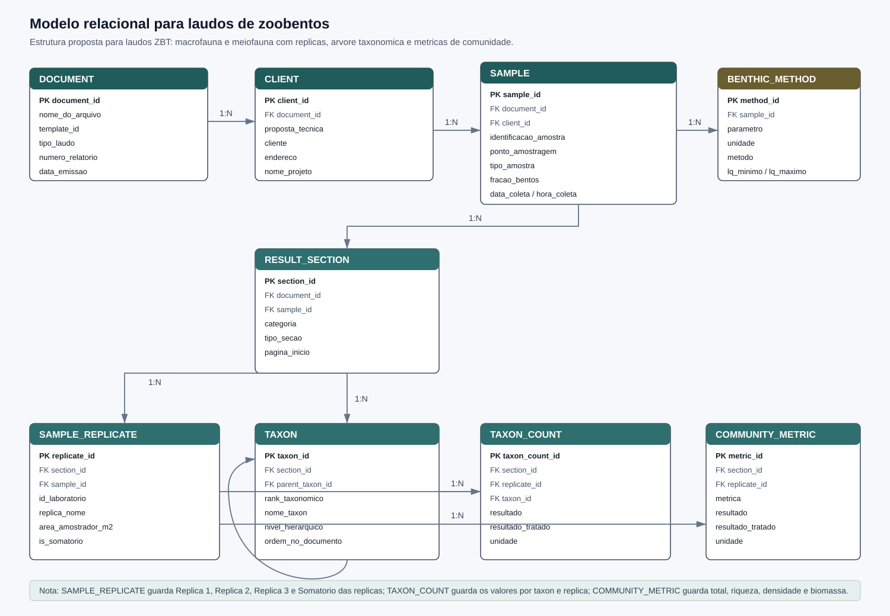

# Modelo Relacional para Laudos de Zoobentos

Este documento descreve uma proposta de modelo relacional para armazenar os dados extraidos dos laudos de zoobentos/bentos. A estrutura observada nos PDFs `ZBT` combina cabecalho do relatorio, identificacao do cliente, identificacao da amostra, metodo analitico e uma tabela de resultados organizada por replicas.

Foram observadas duas variantes principais dentro do mesmo tema:

- `Macroinvertebrados Bentonicos - Macrofauna de fundo inconsolidado`.
- `Meiofauna Bentonica - Meiofauna de fundo inconsolidado`.

As duas variantes podem usar o mesmo modelo relacional. A diferenca fica registrada em `sample.tipo_amostra`, `sample.fracao_bentos` e nos niveis taxonomicos presentes nos resultados.

## Visao Geral

```mermaid
erDiagram
    DOCUMENT ||--o{ CLIENT : possui
    DOCUMENT ||--o{ SAMPLE : contem
    CLIENT ||--o{ SAMPLE : referencia
    SAMPLE ||--o{ BENTHIC_METHOD : usa
    SAMPLE ||--o{ RESULT_SECTION : organiza
    RESULT_SECTION ||--o{ SAMPLE_REPLICATE : contem
    RESULT_SECTION ||--o{ TAXON : descreve
    TAXON ||--o{ TAXON : parent_taxon
    TAXON ||--o{ TAXON_COUNT : quantifica
    SAMPLE_REPLICATE ||--o{ TAXON_COUNT : registra
    SAMPLE_REPLICATE ||--o{ COMMUNITY_METRIC : resume

    DOCUMENT {
        string document_id PK
        string nome_do_arquivo
        string template_id
        string tipo_laudo
        string numero_relatorio
        string revisao
        date data_emissao
        datetime data_processamento
    }

    CLIENT {
        string client_id PK
        string document_id FK
        string proposta_tecnica
        string cliente
        string endereco
        string localidade
        string nome_projeto
    }

    SAMPLE {
        string sample_id PK
        string document_id FK
        string client_id FK
        string id_amostra
        string identificacao_amostra
        string ponto_amostragem
        string matriz
        string tipo_amostra
        string fracao_bentos
        date data_coleta
        string hora_coleta
        date data_entrada_laboratorio
        date data_analise
        string responsavel_amostragem
        string local_analise
        string condicoes_coleta
        string condicoes_armazenamento
        string localizacao_instalacao
    }

    BENTHIC_METHOD {
        string method_id PK
        string sample_id FK
        string parametro
        string unidade
        string metodo
        string revisao_metodo
        string lq_original
        decimal lq_minimo
        decimal lq_maximo
        string lq_unidade
    }

    RESULT_SECTION {
        string section_id PK
        string document_id FK
        string sample_id FK
        string categoria
        string tipo_secao
        string tipo_registro
        int pagina_inicio
        int ordem_no_documento
    }

    SAMPLE_REPLICATE {
        string replicate_id PK
        string section_id FK
        string sample_id FK
        string id_laboratorio
        string ponto_amostragem
        date data_coleta
        string hora_coleta
        date data_ensaio
        decimal area_amostrador_m2
        string replica_nome
        int replica_ordem
        boolean is_somatorio
    }

    TAXON {
        string taxon_id PK
        string section_id FK
        string parent_taxon_id FK
        string rank_taxonomico
        string nome_taxon
        int nivel_hierarquico
        int ordem_no_documento
    }

    TAXON_COUNT {
        string taxon_count_id PK
        string section_id FK
        string replicate_id FK
        string taxon_id FK
        string resultado
        decimal resultado_tratado
        string unidade
        boolean abaixo_lq
    }

    COMMUNITY_METRIC {
        string metric_id PK
        string section_id FK
        string replicate_id FK
        string metrica
        string resultado
        decimal resultado_tratado
        string unidade
        string observacao_calculo
    }
```

## Tabelas

### `document`

Representa o PDF/laudo processado. Deve existir uma linha por arquivo de origem.

- `document_id`: Identificador interno do documento.
- `nome_do_arquivo`: Nome do PDF de origem.
- `template_id`: Template identificado pela taxonomia, como `template_laudo_zbt_v1`.
- `tipo_laudo`: Tema/familia do laudo, como `laudo_zbt`.
- `numero_relatorio`: Numero do relatorio de ensaio, como `25/00B3008`.
- `revisao`: Revisao do laudo.
- `data_emissao`: Data de emissao do laudo.
- `data_processamento`: Data/hora em que o arquivo foi processado.

### `client`

Representa os dados de identificacao do cliente e do projeto.

- `client_id`: Identificador interno do cliente no contexto da extracao.
- `document_id`: Documento de origem.
- `proposta_tecnica`: Codigo da proposta tecnica.
- `cliente`: Nome do cliente.
- `endereco`: Endereco do cliente.
- `localidade`: Localidade informada no cabecalho.
- `nome_projeto`: Nome do projeto.

### `sample`

Representa a amostra descrita no laudo.

- `sample_id`: Identificador interno da amostra.
- `document_id`: Documento de origem.
- `client_id`: Cliente associado.
- `id_amostra`: Identificador interno derivado ou cadastrado para a amostra.
- `identificacao_amostra`: Texto completo da identificacao da amostra.
- `ponto_amostragem`: Ponto de amostragem, como `EBN 01R`.
- `matriz`: Matriz principal, como `zoobentos`.
- `tipo_amostra`: Texto original do campo `Tipo de Amostra`.
- `fracao_bentos`: Classificacao derivada do tipo de amostra, como `macrofauna` ou `meiofauna`.
- `data_coleta`: Data de coleta.
- `hora_coleta`: Hora de coleta.
- `data_entrada_laboratorio`: Data de entrada no laboratorio.
- `data_analise`: Data da analise/ensaio.
- `responsavel_amostragem`: Responsavel pela amostragem, como laboratorio ou contratante.
- `local_analise`: Indicacao de instalacao permanente ou instalacao do cliente.
- `condicoes_coleta`: Condicoes climaticas marcadas no laudo.
- `condicoes_armazenamento`: Condicao de armazenamento, como `Formol a 10%`.
- `localizacao_instalacao`: Localizacao da instalacao permanente.

### `benthic_method`

Representa o metodo declarado antes da tabela de resultados.

- `method_id`: Identificador do metodo.
- `sample_id`: Amostra associada.
- `parametro`: Parametro declarado, como `Invertebrados de Bentonicos`.
- `unidade`: Unidade do resultado, como `Ind./m2`.
- `metodo`: Metodo ou procedimento informado no laudo.
- `revisao_metodo`: Revisao do metodo, quando existir.
- `lq_original`: Texto original do LQ.
- `lq_minimo`: Valor minimo do LQ, repetindo o valor quando nao houver faixa.
- `lq_maximo`: Valor maximo do LQ, repetindo o valor quando nao houver faixa.
- `lq_unidade`: Unidade do LQ, quando declarada.

### `result_section`

Representa a secao `RESULTADOS` do laudo.

- `section_id`: Identificador da secao.
- `document_id`: Documento de origem.
- `sample_id`: Amostra associada.
- `categoria`: Categoria da secao, como `Zoobentos`.
- `tipo_secao`: Subtipo da secao, como `macrofauna` ou `meiofauna`.
- `tipo_registro`: Tipo geral de registro, como `resultado`.
- `pagina_inicio`: Pagina onde a secao comeca.
- `ordem_no_documento`: Ordem da secao no PDF.

### `sample_replicate`

Representa cada coluna de replica da tabela de resultados. A coluna de somatorio tambem pode ser armazenada aqui com `is_somatorio = true`.

- `replicate_id`: Identificador da replica.
- `section_id`: Secao de resultados.
- `sample_id`: Amostra associada.
- `id_laboratorio`: Identificacao do laboratorio exibida na tabela.
- `ponto_amostragem`: Ponto exibido na coluna.
- `data_coleta`: Data de coleta da coluna.
- `hora_coleta`: Hora de coleta, quando exibida.
- `data_ensaio`: Data do ensaio da coluna.
- `area_amostrador_m2`: Area do amostrador usada no calculo de densidade.
- `replica_nome`: Nome original da coluna, como `Replica 1`, `Replica 2`, `Replica 3` ou `Somatorio das replicas`.
- `replica_ordem`: Ordem da replica.
- `is_somatorio`: Indica se a coluna e o somatorio das replicas.

### `taxon`

Representa a arvore taxonomica informada na tabela. Esta tabela evita repetir `Filo`, `Classe`, `Ordem`, `Familia` e taxons finais em cada valor numerico.

- `taxon_id`: Identificador do taxon.
- `section_id`: Secao de resultados.
- `parent_taxon_id`: Taxon pai, quando existir.
- `rank_taxonomico`: Nivel taxonomico, como `filo`, `classe`, `subclasse`, `ordem`, `familia`, `genero` ou `taxon`.
- `nome_taxon`: Nome exibido no laudo.
- `nivel_hierarquico`: Profundidade do taxon na arvore.
- `ordem_no_documento`: Ordem em que o taxon aparece no PDF.

### `taxon_count`

Representa os valores numericos por taxon e por replica. Esta e a tabela central para auditoria da composicao bentonica.

- `taxon_count_id`: Identificador do valor extraido.
- `section_id`: Secao de resultados.
- `replicate_id`: Replica ou somatorio associado.
- `taxon_id`: Taxon associado.
- `resultado`: Texto exatamente como aparece no PDF.
- `resultado_tratado`: Valor numerico validado.
- `unidade`: Unidade do resultado, normalmente `individuos` ou `Ind./m2`, conforme regra de negocio adotada.
- `abaixo_lq`: Indica se o resultado ficou abaixo do limite de quantificacao, quando aplicavel.

### `community_metric`

Representa as linhas de resumo da comunidade bentonica.

- `metric_id`: Identificador da metrica.
- `section_id`: Secao de resultados.
- `replicate_id`: Replica ou somatorio associado.
- `metrica`: Nome da metrica, como `Numero Total de Individuos`, `Riqueza`, `Densidade` ou `Biomassa`.
- `resultado`: Texto exatamente como aparece no PDF.
- `resultado_tratado`: Valor numerico validado.
- `unidade`: Unidade da metrica, como `Ind./m2` ou `gPU/m2`.
- `observacao_calculo`: Observacao de calculo, quando houver nota no laudo.

## Observacoes de Modelagem

- O par macrofauna/meiofauna nao deve gerar dois motores de extracao. O ideal e usar o mesmo template de tema `laudo_zbt` e distinguir a variante no campo `fracao_bentos`.
- A coluna `Somatorio das replicas` pode ser armazenada como uma replica especial para preservar exatamente o que veio no laudo. Caso o banco queira recalcular os somatorios, o valor original continua auditavel.
- A hierarquia taxonomica deve ser preservada mesmo quando um nivel nao possui valor numerico. Esses niveis explicam o contexto dos taxons que aparecem nas linhas seguintes.
- Indicadores finais como riqueza, densidade e biomassa devem ficar em `community_metric`, nao em `taxon_count`, porque nao representam um taxon.
- A biomassa aparece nos laudos de macrofauna observados. Em meiofauna ela pode nao existir; por isso `community_metric` deve aceitar metricas variaveis por documento.
- Para extracoes futuras, este modelo pode conviver com saidas Excel separadas por tema, por exemplo `output/laudo_zbt/extracted_data.xlsx`, contendo abas como `client`, `sample`, `method`, `replicate`, `taxon`, `taxon_count` e `community_metric`.
